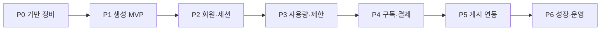

# SNSAgent 개발 계획 (회원가입 · 구독형 SaaS)

> 목표: 인스타 릴스 / 페이스북 / 유튜브 쇼츠 / 틱톡 중심 숏폼 콘텐츠 자동화  
> 인프라: Cloudflare Pages + Functions + D1 + R2  
> 비즈니스: 회원가입 후 **구독(Subscription)** 과금  
> 기준일: 2026-08-04

---

## 1. 제품 방향

| 항목 | 결정 |
|------|------|
| 핵심 가치 | 한국어 숏폼 **대본·캡션 생성** → (이후) 게시·성과 보조 |
| 주력 플랫폼 | Instagram Reels, Facebook, YouTube Shorts, TikTok |
| 과금 모델 | 월/연 구독 (Free + Pro + Business 권장) |
| 배포 | Cloudflare Pages (GitHub 연동) |

**원칙:** 지금 당장 결제 UI를 만들지 않더라도, **사용자·사용량·플랜이 붙을 수 있는 구조**로 기능을 쌓는다.

---

## 2. 권장 구독 티어 (초안)

| 플랜 | 대상 | 포함 (초안) |
|------|------|-------------|
| **Free** | 체험 | 월 N회 생성, 워터마크/히스토리 제한, 1 워크스페이스 |
| **Pro** | 개인 크리에이터 | 월 생성량↑, 4플랫폼, 히스토리·R2 저장, 캡션/대본 무제한에 가깝게 |
| **Business** | 소상공인·에이전시 | 팀 좌석, 브랜드 톤 프리셋, API/웹훅, 우선 지원 |

과금 단위 예시:

- `generations_per_month` (대본/캡션/번들 호출 수)
- `seats` (팀원 수)
- `storage_mb` (R2)
- (후기) `publish_actions` (실제 포스팅 API 호출)

결제: **Stripe Billing** (Checkout + Customer Portal) 권장.  
웹훅은 Pages Function `/api/billing/webhook` 에서 D1 `subscriptions` 갱신.

---

## 3. 전체 로드맵 (Phase)



### Phase 0 — 기반 정비 (1주)

**목적:** 구독형으로 확장 가능한 뼈대만 정리

- [ ] D1 스키마에 `users` / `sessions` 이미 있음 → **플랜·쿼터 컬럼 자리** 확보
- [ ] 모든 API 응답에 `request_id` 추가 (추적용)
- [ ] Secrets 정리: `OPENAI_API_KEY` (필수), 이후 `STRIPE_*`
- [ ] 환경 분리: Preview / Production Bindings·Secrets
- [ ] `.env` / 하드코딩 자격증명 제거 (보안)

**완료 기준:** Pages에서 `/api/health`, `/api/generate` 안정 동작 + Secret 배포 완료

---

### Phase 1 — 콘텐츠 생성 MVP (1~2주) ← **현재 구간**

**목적:** 결제 없이도 “쓸 만한 제품” 검증

- [x] 4플랫폼 한국어 대본/캡션 프롬프트
- [x] Pages `/api/generate` + UI
- [x] 생성 결과 UI 렌더 (카드/장면/캡션)
- [x] 결과 R2 저장 + D1 `generations` / `artifacts`
- [x] 생성 이력 API (`GET /api/generations`, `GET /api/generation/:id`)
- [x] 톤/브랜드 입력 + Free 쿼터 골격 (`/api/me`)
- [ ] 에러·재시도 고도화, 템플릿 주제 세트

**완료 기준:** 비로그인(임시 user)으로도 4플랫폼 생성·재조회 가능

---

### Phase 2 — 회원가입 / 로그인 (1~2주)

**목적:** 사용자를 식별하고 구독의 “주인”을 만든다

권장 스택 (Pages에 잘 맞음):

| 옵션 | 장점 | 비고 |
|------|------|------|
| **Clerk / Auth.js(Google·이메일)** | 구현 빠름 | 추천 |
| Cloudflare Access | Zero Trust에 강함 | B2C 구독엔 덜 적합 |
| 자체 이메일+비밀번호 | 의존성↓ | 보안·메일 부담↑ |

구현 항목:

- [ ] 회원가입 / 로그인 / 로그아웃
- [ ] 세션·JWT, `user_id`를 Functions에서 검증
- [ ] D1 `users`에 email, name, auth_provider, created_at
- [ ] 기존 `user_demo` → 실사용자로 전환
- [ ] 보호 API: `/api/generate`, `/api/chat`, `/api/upload` 는 로그인 필수
- [ ] 마이페이지(계정 정보·이력)

**완료 기준:** 로그인 사용자만 생성 가능, 이력은 본인 것만 조회

---

### Phase 3 — 사용량 측정 · Free 제한 (1주)

**목적:** 구독 전에 “왜 올려야 하는지”를 Free 제한으로 만든다

- [x] D1 `plans` / `subscriptions` / `usage_counters` / `generations` (migration 0002)
- [x] 생성 전 쿼터 체크 → 초과 시 `402` + 업그레이드 안내
- [x] 생성 후 카운터 증가
- [x] Free 기본 구독 row 자동 생성
- [x] UI에 이번 달 사용량 표시
- [ ] 플랜별 한도 UI 카피·업그레이드 CTA 페이지

---

### Phase 4 — 구독 결제 (Stripe) (1~2주)

**목적:** 실제 과금

- [ ] Stripe Product/Price (월간·연간)
- [ ] Checkout Session 생성 API
- [ ] Customer Portal (카드 변경·해지)
- [ ] Webhook: `checkout.session.completed`, `customer.subscription.updated/deleted`
- [ ] D1 `subscriptions` 상태 동기화 (`active`, `past_due`, `canceled`)
- [ ] Pro/Business 한도 적용
- [ ] 영수증·플랜 표시 UI

**완료 기준:** 카드로 Pro 구독 → 한도 상승 → 해지 시 Free 복귀

---

### Phase 5 — 플랫폼 게시·연동 (2~4주)

**목적:** “생성”을 넘어 “배포”로 ARPU 상승

우선순위:

1. Instagram Reels 업로드 (Meta Graph / 비즈니스 계정)
2. YouTube Shorts 업로드
3. TikTok Content Posting API
4. Facebook Reels/페이지 게시

구현 항목:

- [ ] OAuth 연결 (`platform_accounts` 테이블, 토큰은 암호화 저장)
- [ ] 게시 예약 / 즉시 게시
- [ ] 게시 실패 재시도·로그
- [ ] Business 플랜에만 다중 계정

**완료 기준:** 최소 1개 플랫폼에서 Pro 사용자가 생성된 캡션으로 게시 성공

---

### Phase 6 — 성장·운영 (지속)

- [ ] 온보딩 튜토리얼, 샘플 주제 템플릿
- [ ] 관리자 대시보드 (가입·MRR·생성량)
- [ ] 이메일: 가입 환영, 한도 임박, 결제 실패
- [ ] 약관 / 개인정보 / 환불 정책 페이지
- [ ] 모니터링: Cloudflare Analytics + 에러 알림
- [ ] (선택) 팀 워크스페이스, 브랜드 보이스 저장

---

## 4. 데이터 모델 (구독형 대비)

```
users
  id, email, name, auth_provider, created_at

subscriptions
  id, user_id, stripe_customer_id, stripe_subscription_id
  plan_id, status, current_period_end

plans
  id, code(free|pro|business), generations_per_month, seats, price_id

usage_counters
  user_id, period, generations_used

generations (또는 artifacts 확장)
  id, user_id, platform, content_type, r2_key, created_at, tokens/cost

platform_accounts (Phase 5)
  id, user_id, platform, access_token_enc, expires_at
```

기존 `chat_messages` / `artifacts` / R2 경로에는 반드시 **`user_id` 스코프** 유지.

---

## 5. API 스케치 (최종 형태)

| Method | Path | 인증 | 설명 |
|--------|------|------|------|
| POST | `/api/auth/*` | — | 가입/로그인 (또는 외부 IdP) |
| GET | `/api/me` | ● | 프로필·플랜·잔여 쿼터 |
| POST | `/api/generate` | ● | 생성 (쿼터 차감) |
| GET | `/api/generations` | ● | 이력 |
| POST | `/api/billing/checkout` | ● | Stripe Checkout |
| POST | `/api/billing/portal` | ● | 고객 포털 |
| POST | `/api/billing/webhook` | Stripe 서명 | 구독 동기화 |
| POST | `/api/publish` | ● + Pro | (Phase 5) 게시 |

---

## 6. 지금 당장 지키는 개발 규칙

구독형을 나중에 붙이려면 **지금 코드에서** 아래를 지키세요.

1. **익명 `user_demo`에 비즈니스 로직을 굳히지 않기** — `user_id`를 인자/세션으로 받기  
2. **생성 = 빌링 단위** — `/api/generate` 한 곳이 과금·쿼터의 단일 진입점  
3. **플랜별 분기 한곳** — `assertCanGenerate(user)` 같은 가드 함수  
4. **Secrets는 환경변수만** — 코드·Git에 키 금지  
5. **UI는 “결과 → 업그레이드 CTA” 자리 남기기** — Free 한도 초과 UI 여백  
6. **X 등 비주력 플랫폼은 유지하되 마케팅/온보딩에서 빼기** — 범위 분산 방지  

---

## 7. 일정 제안 (압축)

| 주차 | Phase | 산출물 |
|------|-------|--------|
| 1 | P0 + P1 마무리 | 안정 생성 MVP, Secret, UI 개선 |
| 2–3 | P2 | 회원가입/로그인, 내 이력 |
| 4 | P3 | Free 쿼터 |
| 5–6 | P4 | Stripe 구독 라이브 |
| 7–10 | P5 | 1~2개 플랫폼 게시 |
| 이후 | P6 | 전환율·리텐션·운영 |

---

## 8. 성공 지표 (북극성)

- **활성화:** 주간 생성 횟수 (WAU × generations)
- **전환:** Free → Paid 전환율
- **수익:** MRR, churn
- **품질:** 생성 성공률, p95 지연, OpenAI 비용/유저

---

## 9. 다음 실행 추천 (바로 착수할 일)

1. Pages에 `OPENAI_API_KEY` Secret 등록 후 생성 검증  
2. **P1 남은 작업:** 결과 UI 개선 + R2/이력 저장  
3. Auth 제공자 선택 (Clerk vs Auth.js) 확정  
4. D1 마이그레이션 `0002_billing_ready.sql`로 `plans` / `subscriptions` / `usage_counters` 추가  

이 순서로 가면 “콘텐츠 가치 검증 → 회원 종속 → 한도로 전환 유도 → 결제”가 자연스럽게 이어집니다.
